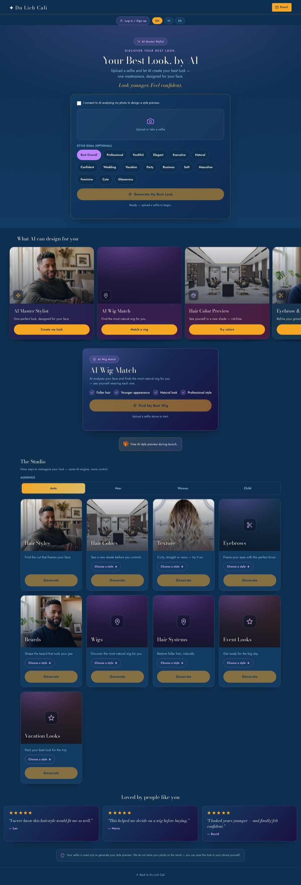
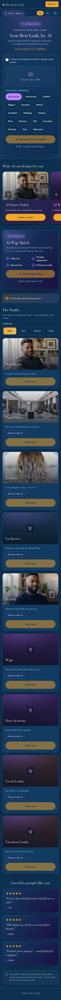

# SP-3 — Premium AI Style Studio UX

- **Date:** 2026-06-14 · **Surface:** public `/style-studio` · **Scope:** frontend-only (no backend, no commerce, no partner APIs, no new callables/collections). · **Version:** `?v=20260614a`.
- **Status:** Implemented + verified (live browser audit + screenshots). Commit `76700dd`. Awaiting production deploy approval.

## Screenshots
| Desktop (1280px) | Mobile (390px) |
|---|---|
|  |  |

## Before → After (the page itself)
| Before (SP-1/2) | After (SP-3) |
|---|---|
| Narrow column; thin/utilitarian feel | Wide premium layout, `max-width: 1480px`, multi-column desktop |
| 9 modes hidden in a `+`/`−` **accordion** | 9 modes as large **Netflix-style image/gradient cards** ("The Studio") |
| Wig Match a secondary section | **AI Wig Match co-flagship** with benefits checklist + before/after |
| Functional copy | Emotional copy ("Discover your best look", "Look younger. Feel confident.") |
| Result = single image | **Before → After** (your selfie → AI result) slider in results + viewer |
| No social proof | ★★★★★ **testimonials** section |
| Login chip only | Profile panel: **favorites + saved-looks history** (local) |

## The 10 requirements
1. **Desktop redesign** — sections cap at `1480px` centered; tighter vertical rhythm; gallery 3-col @1024 / 4-col @1200; mobile stays single-column.
2. **Wig Match co-flagship** — large premium section, benefits checklist (✓ Fuller hair · Younger · Natural · Professional), large "Find My Best Wig" CTA, 5-wig carousel, before→after on the best match.
3. **Studio Gallery** — accordion **removed** (0 `.ss-panel`); 9 large cards (image or premium gradient+icon) with title + emotional line + chip-reveal options + **Generate** → reuses the existing `onModeGenerate` (no backend change).
4. **Showcase carousel** — enhanced large image/gradient cards, swipeable scroll-snap; existing CTA wiring kept (Master/Wig/Colors/Eyebrow&Beard/Event&Vacation).
5. **Before → After (honest)** — real pairing: `state.selfieDataUrl` (before) → generated `previewDataUrl` (after) as a draggable slider in master + wig results and the viewer. No mislabeled stock photos.
6. **Full-screen viewer** — kept the self-contained `ss-viewer` (pinch/swipe/close, iOS scroll-lock-and-restore, Save/Share) + added a Before/After toggle.
7. **Testimonials** — SVG ★★★★★ + placeholder quotes (vi/en/es, marked as launch placeholders).
8. **Emotional copy** — hero/section copy rewritten to warm, benefit-led, non-technical (all 3 languages).
9. **Account experience** — profile-icon panel: profile + **Favorites** (`ss_public_favorites`) + **Saved looks / history** (`ss_recent_looks`, on-device only); stays logged in until logout (no repeated prompts).
10. **No regressions** — Master Stylist, Wig Match, viewer, account/auth, member-aware gate, never-silent guards, logs, privacy, and the i18n all preserved.

## Image mapping (all 200)
Hair Styles → `modern-styling.jpg`; Hair Colors → `hair-3.jpg`; Texture → `hair-2.jpg`; Beards → `haircut-beard.jpg`. Eyebrows / Wigs / Hair Systems / Event / Vacation → premium gradient+icon cards (no honest photo exists; never mislabeled).

## Files changed
`style-studio.html` (+30), `style-studio.css` (+366), `style-studio-public.js` (+702). **No** `functions/`, `firestore.rules`, or collection changes (verified: 0 diff lines).

## Tests / verification
- Live browser audit (Playwright, 1280px + 375px): 9 gallery cards · 5 showcase · 3 testimonials · 11 wig-benefit items · **0 native selects · 0 accordion panels · 0 console errors**; viewer scroll-lock **restores** on close; before/after + account panel functional. Desktop shell `max-width: 1480px`.
- `node tests/unit/style-studio.test.js` → 48 passed · `node --check` clean · `scripts/ai/full_system_dry_run.sh` → `FINAL: PASS`.
- `git show --stat 76700dd` → only the 3 frontend files.

## Limitations
- No wig-specific stock photos exist → those gallery cards use premium gradient+icon treatment (honest, on-brand). Real wig imagery would further lift them later.
- Testimonials are explicit launch **placeholders** (clearly marked) until real reviews exist.
- Saved-looks history is **on-device** (localStorage) per the no-new-collections constraint; cross-device history remains a future (membership) phase.
- Live AI image fidelity is model-dependent (unchanged this phase).

**PASS / BLOCKED:** Implemented + verified premium on mobile + desktop (screenshots above) → **PASS pending production deploy + your on-device confirmation** that it feels like a premium consumer AI app.
