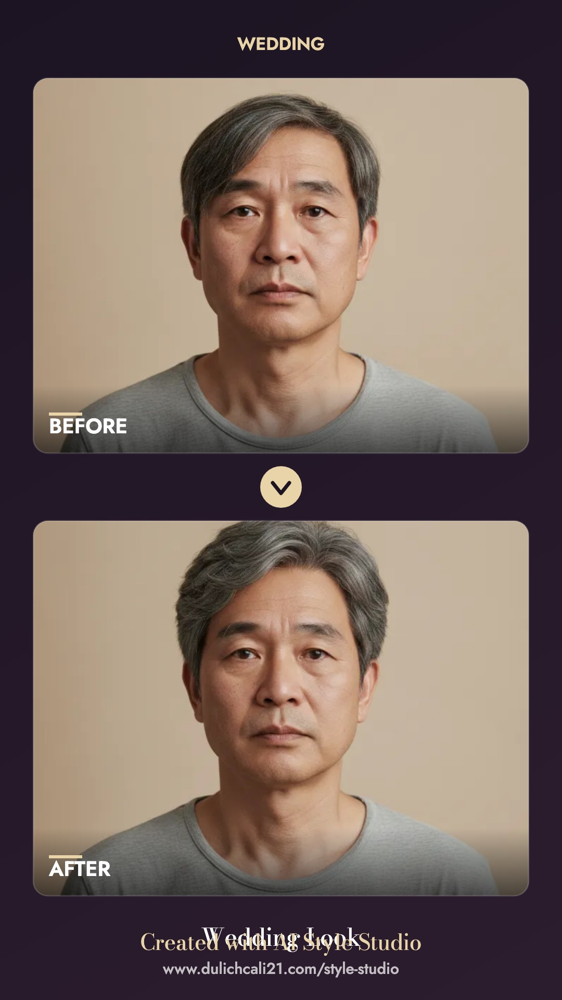
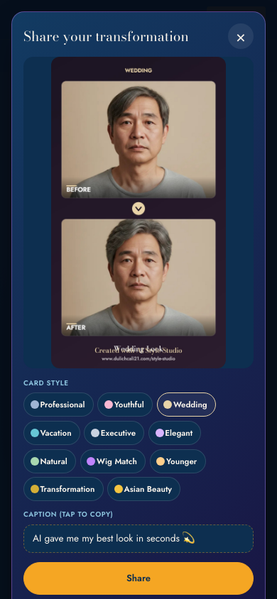
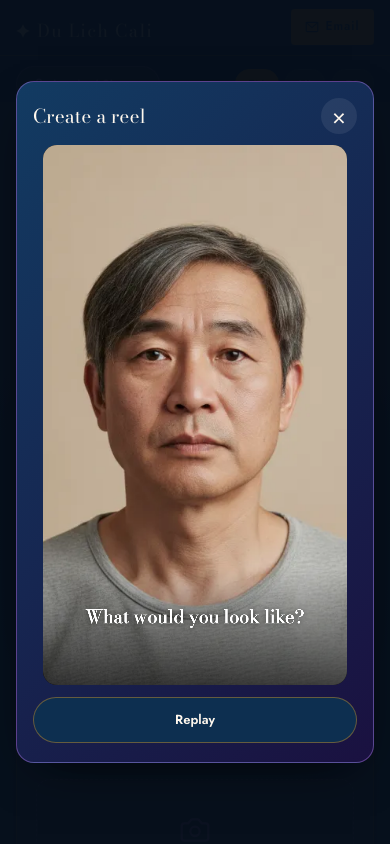

# SP-10.5 — Viral Transformation Engine

- **Date:** 2026-06-15 · **Scope:** make sharing a transformation effortless — on-device before→after **share cards**, **one-tap share**, **auto captions**, an in-app **reel**, and a **transformation gallery**. **No new AI capability.** Frontend-only — `functions/index.js` untouched. · **Version:** `?v=20260615a`.
- **Status:** Implemented + verified (i18n parity 451 keys ×vi/en/es; live Playwright on card/share/reel + a decode-aware privacy assertion; 48 unit tests pass; `full_system_dry_run` → `FINAL: PASS`). Awaiting deploy approval.

## Important: reels reuse the existing `ai_social_content_agent` project
Brand/marketing reels are **already built** in the separate **`ai_social_content_agent`** project — `remotion/src/StyleStudioPromo.jsx` + `backend/services/remotion_render_service.mjs` (+ ffmpeg), with the AI Style Studio reels already rendered for every platform at `generated/videos/ai_style_studio_promo_{master,facebook_reel,instagram_reel,tiktok,youtube_shorts}.mp4` (1080×1920, FB/IG/TikTok/YT Shorts). **SP-10.5 does NOT reimplement that** — an earlier draft created an in-repo `remotion/style_studio_reel/` and it was removed. Use the agent project for brand reels.

What SP-10.5 adds in *this* repo is the **on-device, per-customer** viral layer that the agent project deliberately does not do (it would require sending the customer's selfie to a render server, violating privacy-first).

## Files changed
| File | Change |
|---|---|
| `style-studio-public.js` | SP-10.5 i18n (vi/en/es); `buildShareCard` (canvas); share sheet; captions; 11 card themes; in-app `openReel`; share/reel buttons on results + saved looks; per-session local "before" cache |
| `style-studio.css` | share sheet, reel overlay, toast, theme chips, share buttons (mobile-first + 768) |
| `style-studio.html` | `?v=` bump (css+js → `20260615a`) |

## Architecture (all on-device, privacy-first)
- **10.5A Share card** — `buildShareCard(before, after, theme, title)` composites a **1080×1920** before→after card on a `<canvas>` (elegant Bodoni/Jost type, theme overlay, footer watermark) and returns a JPEG data URL. Inputs are the user's own selfie + the generated result (both data URLs) — **nothing is uploaded**.
- **Card styles (10.5G)** — `SHARE_THEMES`: Professional, Youthful, Wedding, Vacation, Executive, Elegant, Natural, Wig Match, Younger, Transformation, Asian Beauty (11) — each a distinct luxury accent/gradient, switchable in the sheet.
- **10.5B One-tap share** — primary **Share** uses the **Web Share API with the image file** (covers Instagram/Messenger/WhatsApp/Facebook via the native sheet on iPhone). Secondary: **Save to Photos**, **Copy link**, **Facebook** (sharer link), **WhatsApp** (text link), **Messenger**, **Instagram** (save + "add to your Story/Reel" hint). iPhone-first with graceful fallbacks.
- **10.5D Auto captions** — `CAPTIONS` per-language pools (the requested examples + more), picked at random; tap-to-copy.
- **10.5C In-app reel** — `openReel` plays the 5-scene transformation (selfie → "What would you look like?" → AI analyzing → before/after wipe → zoom final → logo + "Try it Free") on a canvas. Where the browser supports `MediaRecorder` + `captureStream`, it exports a downloadable/shareable video; otherwise it still plays in-page and the user shares the card. Muted (autoplay-safe); no licensed music shipped.
- **10.5E Hero demo loop** — satisfied by SP-7's existing auto-play muted hero demo (upload → analyzing → before → after) at the top of `/style-studio`.
- **10.5F Watermark** — every card + reel carries an elegant "Created with AI Style Studio / www.dulichcali21.com/style-studio" footer.
- **10.5H Transformation gallery** — generated looks already live in History/Favorites (per-profile, local). SP-10.5 caches the session "before" selfie **on-device** (localStorage, never Firestore) so any saved look can be re-shared as an honest before→after card via a Share button on its tile.

## Privacy (verified)
- Card + reel composited entirely on-device; **selfie/result never uploaded**.
- Native Share hands the image to the OS share sheet (user-initiated, on-device).
- **Facebook / WhatsApp / Messenger / Copy link carry ONLY the studio URL + caption text — never the image.** Verified live (decode-aware): `sharer.php?u=…dulichcali21.com/style-studio`, `wa.me/?text=<caption> <studio url>`, clipboard = studio URL — zero `data:image`/base64 in any target.
- The on-device "before" cache reuses the existing `MobileBarberAIPreview` localStorage cache (same mechanism as result thumbnails) — no Firestore/Storage, consistent with the no-store rule.

## Tests (10.5J)
- **i18n parity:** 451 keys present in vi/en/es, no gaps/empties.
- **Live Playwright (iPhone 390px, headless Chromium):** card builds (JPEG, ~195 KB) ✓; share sheet = 11 theme chips + 7 buttons + caption + preview ✓; **privacy: FB/WhatsApp/Copy carry only the studio URL (decode-checked), no image** ✓; reel mime `video/mp4`, canvas renders, **download shown after playback (MediaRecorder export works)** ✓; **0 console errors** ✓.
- `node --check` clean · `node tests/unit/style-studio.test.js` → **48 passed** · `scripts/ai/full_system_dry_run.sh` → **FINAL: PASS**.
- DO-NOT-BREAK: `functions/index.js` untouched; share/reel/cache changes are additive (gated on an honest before/after); Master Stylist / Wig / Upload / Membership / Collections / Family / Concierge / Vendor Studio paths unchanged.

## Screenshots / examples

Brand reel examples (already rendered, in the agent project): `ai_social_content_agent/generated/videos/ai_style_studio_promo_{instagram_reel,facebook_reel,tiktok,youtube_shorts}.mp4`.

## Limitations / honest caveats
- **iPhone video export**: Safari's `MediaRecorder` canvas capture is unreliable; on iPhone the reel **plays in-page** and the shareable artifact is the **card image** (the universal viral unit). Desktop/Android Chrome export `video/mp4` or `webm`.
- **Music**: no licensed/"Apple-style" track is shipped; the in-app reel is muted, and the agent project's reels use only audio the project is licensed for.
- **Per-user reels are client-side only** by design (privacy) — they are not server-rendered and not posted anywhere automatically.
- Instagram has no web image-share intent → the IG button saves the card + prompts the user to post it (native Share also surfaces IG on mobile).

## PASS criteria
| Requirement | Result |
|---|---|
| Beautiful before→after card after any successful generation | ✅ 10.5A, 11 themes, watermark, on-device |
| One-tap share (FB/Messenger/IG/WhatsApp/Save/Copy), Web Share, iPhone-first | ✅ 10.5B |
| Viral reel (5 scenes, vertical) | ✅ in-app client-side reel + agent-project brand reels (FB/IG/TikTok/YT, already rendered) |
| Auto social captions (vi/en) | ✅ 10.5D vi/en/es |
| Hero demo loop | ✅ 10.5E (SP-7 hero demo) |
| Watermark | ✅ 10.5F |
| Themed cards | ✅ 10.5G (11 incl. Younger / Transformation / Asian Beauty / Wig Match) |
| Transformation gallery, no selfie leaves platform | ✅ 10.5H, local-only |
| Reel assets | ✅ reuse `ai_social_content_agent` (`StyleStudioPromo.jsx` + render service) — not reimplemented |
| Privacy preserved; vendor Studio + all DO-NOT-BREAK surfaces unaffected | ✅ |

**PASS / BLOCKED:** users can effortlessly create a beautiful before→after card (and a reel where the device supports it) and share it in one tap — privacy-safe, trilingual, without touching the generation engine, and reusing (not duplicating) the agent project's brand-reel pipeline → **PASS pending production deploy + your on-device confirmation.**
