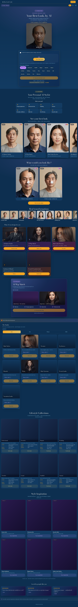

# SP-10 — AI Concierge + Local Fitting Services + Collections

- **Date:** 2026-06-14 · **Scope:** evolve AI Style Studio from an image generator into a **personal AI stylist + real-world beauty concierge** — fitting consultation, AI Concierge plans, saved collections, family profiles, lifestyle collections, style inspiration, and a customer dashboard. **No payment. No inventory. No partner contact. No new AI-generation logic.** Frontend-only — `functions/index.js` (the generation backend) is untouched. · **Version:** `?v=20260614m`.
- **Status:** Implemented + verified (i18n parity 410 keys ×3 langs; live Playwright smoke on every surface, 0 console errors; 48 unit tests pass; `full_system_dry_run` → `FINAL: PASS`; adversarial multi-agent review). Awaiting deploy approval.

## Files changed
| File | Change |
|---|---|
| `style-studio-public.js` | SP-10 i18n (vi/en/es); concierge/lifestyle/inspiration config + render; family-profile engine + per-profile namespacing; compare + shop-later; dashboard rewrite; enhanced consult |
| `style-studio.html` | `#ssConciergeWrap`, `#ssLifestyleWrap`, `#ssInspirationWrap` sections; `?v=` bump (css+js → `20260614m`) |
| `style-studio.css` | SP-10 component styles (mobile-first + 768 + 1200) |
| `assets/style-studio/collections/*.webp` (8) | AI-generated lifestyle covers (Asian-majority, IP-safe) |
| `assets/style-studio/inspiration/*.webp` (6) | AI-generated inspiration covers (generic models, never a real person) |

## Architecture
Everything is a **config-driven, additive layer** inside the existing `style-studio-public.js` IIFE — reusing the established `state` / `t()` / `SS_STRINGS` / render patterns, the existing booking/contact channel, and the existing local-storage privacy model. The generation engine and all DO-NOT-BREAK surfaces are unchanged.

### 10A — Book Fitting Consultation
`openConsult(wrap, best, fromLabel)` now renders a **service multi-select** (`FITTING_SERVICES` = wig fitting / hair system fitting / trimming / styling / maintenance) + a **provider picker** (`PROVIDERS` = `[{id:'michael',name:'Michael'}]`, config-driven — add a barber = edit the array). The chosen services + provider ride in the `tel:`/`mailto:` **as text only** (subject + body). No payment, no checkout, no scheduling change — it reuses the existing DuLichCali contact channel. Reachable after AI Wig Match (SP-9 shop block) and from any Concierge plan.

### 10B — AI Concierge
`CONCIERGE_GOALS` maps each of the 8 goals (younger / professional / wedding / vacation / everyday confidence / fuller hair / hair thinning / executive) to a transparent plan: **style + color + density + texture + wig/hair-system recommendation + provider/service + a "why this works"**. "Generate this look" pre-fills the goal and runs the **existing** AI Master Stylist (no new model, quota-safe); "Book a consultation" opens 10A. This is honest stylist *guidance* — it never fabricates a separate AI call.

### 10C — Saved Collections (Pinterest-style, per profile)
Five local buckets, each scoped to the active family profile: **Favorites** (heart on looks), **Saved Looks/History** (auto-recorded generations), **Wishlist** (heart on products), **Shop Later** (bookmark on products), **Compare** (select ≤4 looks → side-by-side view). All `localStorage` only — text reference + on-device image cache key, **never image bytes, never Firestore**.

### 10D — Family Profiles
One account → many profiles (`PROFILES_KEY`, relations me/husband/wife/child/parent). The active profile id namespaces **every** per-profile store via `nsKey(base) → base + '__p_' + id`. A one-time `migrateLegacyStores()` moves pre-existing favorites/history/saved-products into the default `me` profile so nothing is lost. Profiles are local-only (privacy-first; no Firestore schema change).

### 10E — Lifestyle Collections
`LIFESTYLE_COLLECTIONS` (Professional / Executive / Elegant / Wedding / Vacation / Casual / Youthful / Natural) — each a cover image + recommended **colors / density / lengths** + a "Try this style" CTA that pre-fills the matching goal. Cover art is AI-generated (Asian-majority, beauty-editorial); a premium gradient fallback means no card is ever blank.

### 10F — Style Inspiration (inspired-by only)
`INSPIRATION` (Korean Actor / Vietnamese Star / Executive / Classic Gentleman / Elegant Woman / Modern Asian Fashion) — **generic categories, never a named person**. Covers are original generic models (the generator prompt explicitly forbade celebrity likeness). "Try an inspired look" generates an **original** look for the user. A standing disclaimer states it creates an original look, never a copy.

### 10G — Account Dashboard ("My Studio")
`renderAccountPanel` is now an 8-section dashboard: **Saved Looks · History · Wishlist · Shop Later · Compare · Collections · Family · Membership** (+ the Premium "coming soon" placeholder), with a profile switcher on top. Reachable by members (account chip) and guests (a "My Studio" quota link — guest collections persist locally and carry over at sign-up).

## Privacy (the core guarantee)
- **No selfie / generated image / customer identity is ever sent to a provider or partner.** Consultation = `tel:`/`mailto:` to Du Lịch Cali with **text only** (services + provider + style title). Verified live: the consult `mailto:` href contains no `data:image`/base64.
- **All collections, profiles, compare and tracking are `localStorage` only** (per-profile), text references + on-device cache keys — never image bytes, never Firestore, never an external request.
- **Inspiration is IP-safe** — generic original cover models, "inspired by" framing, original generation, explicit no-copy disclaimer.
- `functions/index.js` is untouched — no backend/data-model/security-rule change.

## Tests
- **i18n parity:** 410 keys present in **vi + en + es**, no missing, no empty values.
- **Live Playwright (iPhone 390px):** 8 concierge goals · 8 lifestyle cards (+8 images) · 6 inspiration cards (+6 images) · concierge plan (6 rows + Generate + Consult) · consult (5 services + 2 providers, `tel:` present, **mailto has no image**) · dashboard (8 tabs) · add profile 1→2 · family rows · premium placeholder · EN→VI→ES switch changes all text · **0 console errors**. Desktop 1280px snapshot captured.
- `node --check` clean · `node tests/unit/style-studio.test.js` → **48 passed** (regression) · `scripts/ai/full_system_dry_run.sh` → **FINAL: PASS** · multi-agent adversarial review (privacy / i18n / no-regression / mobile-CSS / spec-completeness).

## Screenshots

## PASS criteria
| Requirement | Result |
|---|---|
| Book Fitting Consultation w/ services + provider (Michael), no payment | ✅ 10A — reuses contact channel, config-driven providers |
| AI Concierge: goal → style/color/density/texture/wig/provider/consult | ✅ 10B — 8 goals, transparent plan, existing generator |
| Saved Collections (Favorites/Saved/Wishlist/Shop Later/Compare) | ✅ 10C — per-profile local buckets |
| Family Profiles (one account, husband/wife/children/parents) | ✅ 10D — namespaced stores, migration preserves data |
| Lifestyle Collections w/ images + colors/density/lengths | ✅ 10E — 8 collections, AI covers |
| Celebrity Inspiration — inspired-by, never a clone | ✅ 10F — generic categories + disclaimer |
| Account Dashboard | ✅ 10G — 8 sections + profile switcher + Premium soon |
| No payment / no inventory / no partner contact / no new AI logic | ✅ all honored |
| Privacy — never send selfies/images/identity externally | ✅ text-only contact, local-only stores |
| Do not break Master Stylist / Wig / Harmony / Catalog / Upload / Save / Membership / Vendor | ✅ additive; `functions/index.js` untouched |

## Limitations
- Concierge plans + collections are curated/heuristic (style vocabulary mapping), not a learned recommender.
- Family profiles + collections are **on-device only** (privacy-first) — they do not yet sync across a member's devices via the account.
- Inspiration/lifestyle cover art is AI-generated placeholder editorial, not a managed CMS.
- Compare is capped at 4 looks; image bytes live in the existing on-device cache (cleared with browser data).

## Future expansion
1. Optional account-synced collections/profiles (a new Firestore collection + rules, text-only, reusing the booking/admin patterns) so a member's looks follow them across devices.
2. Real provider roster + availability for fitting consultations (still no payment until a billing decision).
3. Personalized concierge ranking from the user's saved/compare signals (local first).
4. Promote a chosen lifestyle/inspiration goal straight into a one-tap generate with the matching mode options pre-set.

**PASS / BLOCKED:** AI Style Studio now spans goal → plan → generate → save/compare/collections → family profiles → real-world fitting consultation, privacy-safe and trilingual, without payment/inventory/partner contact and without touching the generation engine → **PASS pending production deploy + your on-device confirmation.**
