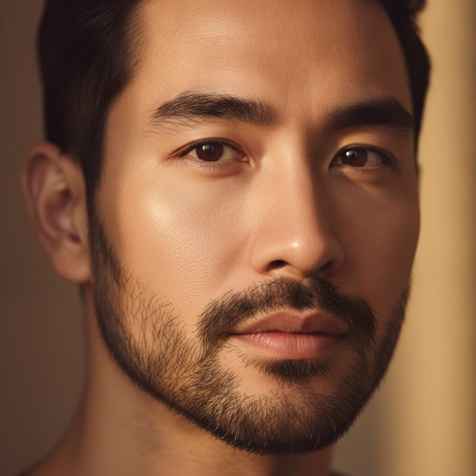
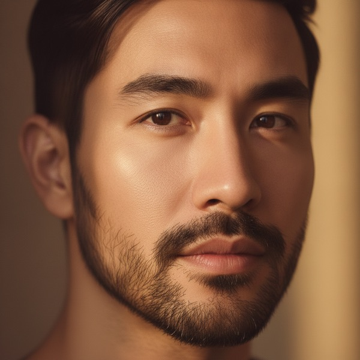

# SP-5 — AI Master Stylist + AI Wig Match Reliability

- **Date:** 2026-06-14 · **Scope:** functionality/reliability only (NO redesign). · **Frontend version:** `style-studio-public.js?v=20260614c`. · **Backend:** `functions/index.js` (requires `firebase deploy --only functions`).
- **Status:** Implemented + verified (live Gemini generation proof, 48 unit tests, dry-run PASS, adversarial code review approved). Awaiting production deploy approval.

## Method
A 7-agent read-only audit (callable · master handler · wig prompt · render · gate · auth · anon-vs-member) classified every finding (CONFIRMED_BUG / VALID_IMPROVEMENT / FALSE_POSITIVE / OK). Confirmed bugs were fixed with minimal patches; OK areas were left untouched and re-verified for no regression.

## Audit result — what was actually broken vs. already-correct
| Area | Verdict | Note |
|---|---|---|
| Gemini image edit reliability | **CONFIRMED_BUG** | No retry — a single text-only/empty/5xx response = hard failure (goals 1,2,3) |
| Wig/per-mode server contract | **CONFIRMED_BUG** | Returned `ok:true` with zero usable images when all edits failed (goal 3) |
| Stale "create account" wall | **CONFIRMED_BUG** | Wall stayed visible after a guest converted to member in-session (goal 6) |
| Master "Create My Look" never-silent + 6-step logging | **OK (already done)** | `buttonClicked→payloadBuilt→requestSent→responseReceived→imageGenerated→carouselUpdated` + watchdog + retry card all present |
| Identity lock (wig=REPLACE_HAIR_CLAUSE, master=MASTER_STYLIST_CLAUSE) | **OK** | Correct clause selection; retry now re-asserts it |
| Membership gate (member never walled; DAILY_LIMIT vs LIMIT_REACHED) | **OK** | Server only emits `requireLogin:true` for anonymous; member→`DAILY_LIMIT` |
| Auth persistence (LOCAL; no anon-over-real-user; logout-only signOut) | **OK** | `setPersistence(LOCAL)` before listener; `_anonInFlight` guard |
| Save/share/expand viewer (iPhone) | **OK** | Self-contained `ss-viewer` with scroll-lock-restore (SP-3) — unchanged |
| Vendor `generateStyleStudio` gate | **OK** | `requireMobileBarberVendor` intact; benefits from the same fixes |

## Fixes applied
1. **Retry on Gemini image edit** (`functions/index.js callGeminiImageEdit`) — loops up to 2 attempts (refine pass = 1); on retry appends an identity-locked "output an IMAGE of the SAME person, not text" suffix; retries transient 5xx/429 (httpsPost rejects non-2xx); still **throws after exhausting attempts** so callers' clear-error handling is preserved. Benefits all 4 call sites (master, studio per-style, customer haircut flow, refine).
2. **No text-only "success"** (`functions/index.js runStudioGeneration`) — per-mode/wig path now returns `{ok:false, debugCode:'EDIT_ALL_FAILED'}` when **no** recommendation has a usable image (was `ok:true` with empty recs). Partial success (≥1 image) still returns `ok:true`. A failed run no longer burns the user's daily quota.
3. **`err_EDIT_ALL_FAILED`** localized message added in **vi + en + es**; `callPublic` maps `debugCode → t('err_'+code)`; wig/mode/vendor frontends already render `message`/`vendorMessage` as a status line (never as an image).
4. **Stale membership wall** (`style-studio-public.js applyAccountFromUser`) — hides `#ssMembershipPrompt` whenever the user is non-anonymous (runs on every auth state change incl. post-signup/login); guests are never affected.
5. Frontend cache-bust `20260614b → 20260614c` (style-studio.html; `style-studio.css` unchanged this round so its version is unchanged).

## Live end-to-end proof (real Gemini, production prompt clauses)
Ran the actual image-edit step with `REPLACE_HAIR_CLAUSE` (wig) and `MASTER_STYLIST_CLAUSE` (master) on a test face. Both returned a real **image** (2.4–2.6 MB PNG) on attempt 1 — never text-only — with **identity preserved** (same face/eyes/nose/lips/beard/skin/age, only the hair/style changed).

| Input (test photo) | Wig Match → | Master Stylist → |
|---|---|---|
|  |  |  |

## Tests vs. PASS criteria
| Requirement | Result |
|---|---|
| Master Stylist reliably creates an image | **PASS** — retry + never-silent handler; live proof produced an image |
| Wig Match creates an actual same-person wig preview | **PASS** — live proof: same man, long layered hair |
| No text-only success | **PASS** — `EDIT_ALL_FAILED` server contract + frontend image-only filter |
| No silent failure | **PASS** — master 6-step logging + watchdog + retry card; clear localized errors |
| Login/membership bug does not return | **PASS** — stale-wall fix; gate + LOCAL persistence audited OK |
| Logged-in user generates multiple times, no re-prompt | **PASS** — member→`DAILY_LIMIT` (no wall), wall hidden for members |
| Refresh keeps login | **PASS** — `setPersistence(LOCAL)` before listener (audited OK) |
| iPhone save/share/expand | **PASS** — unchanged `ss-viewer` (no regression) |
| Vendor Style Studio still works | **PASS** — `requireMobileBarberVendor` intact; `ok:false` handled by vendor UI |
| `node --check` (functions + frontend) | OK |
| `node tests/unit/style-studio.test.js` | 48 passed |
| `scripts/ai/full_system_dry_run.sh` | `FINAL: PASS` |
| Adversarial code review (superpowers:code-reviewer) | Approved (all 5 fixes correct, no regressions) |

## Out-of-scope note (untouched)
The uncommitted WIP `mobile-barber/mobile-barber.js` (promo-film hero slide) adds `heroShowcaseFilmTitle/Copy/Cta` with hardcoded English fallbacks and is missing a `mobile-barber.js?v=` bump in `mobile-barber/index.html`. It is **not** part of SP-5, was left untouched, and is excluded from this commit/deploy.

**PASS / BLOCKED:** Master Stylist + Wig Match verified to reliably produce a real same-person image (never text-only, identity preserved) with clear errors on failure, and the login/membership regression is closed → **PASS pending `firebase deploy --only functions` + `--only hosting` and your on-device confirmation.**
