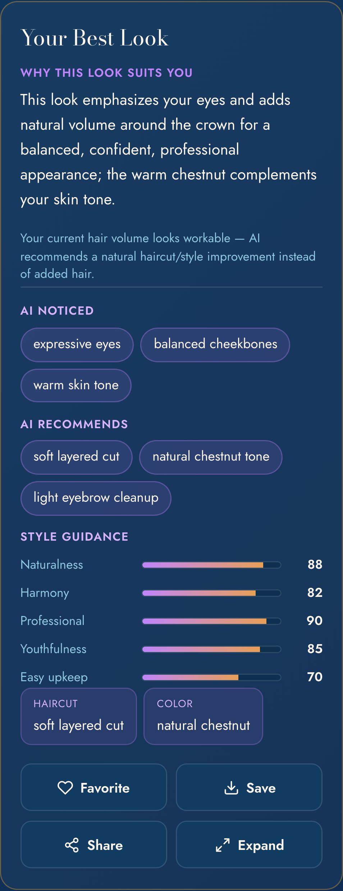

# SP-6 — AI Style Studio Facial Harmony Engine

- **Date:** 2026-06-14 · **Scope:** turn the Master Stylist into a facial-harmony personal stylist (analysis → decision → generation → friendly explanation). Builds on the wig-realism fix; does NOT change it. · **Frontend:** `?v=20260614f`. · **Backend:** `functions/index.js` + `functions/style-studio-lib.js` (needs `deploy --only functions`).
- **Status:** Implemented + verified (5-case live analysis matrix + UI render test; 48 unit tests; dry-run PASS; adversarial review approved). Awaiting deploy approval.

## Architecture (Master "Find My Best Look" flow)
1. Upload selfie → 2. **Facial harmony analysis** (features + scores + strategy + thinning + hair-volume) → 3. **Identify strengths** (`strategy.emphasize`) + 4. **balance targets** (`strategy.balance`) → 5. **Style decision** (`wigDecision` + priority order) → 6. **Generate one best image** (natural-hair clauses + realism gate from the prior fix) → 7. **Explain why** (goal-aware `explanation` + friendly `harmony.noticed`/`harmony.recommends`). Much of 6A–6G already existed from the wig-intelligence work; SP-6 adds the customer-facing harmony surfacing (6D/6H), `naturalness`/`harmony` scores, goal-aware explanation, and the `casual` lifestyle goal.

## JSON schema (returned by the analysis)
```jsonc
analysis: {
  features: { faceShape, faceLengthWidth, forehead, eyes, eyelids, brows, nose, lips,
              cheeks, jawChin, ears, hairline, hairDensity, crownVisibility,
              currentHairLength, beardDensity, skinToneBand, approxAgeRange },  // positive phrases
  scores:   { symmetry, harmony, naturalness, youthfulness, professional,
              confidence, softness, maintenance },                              // 0..100, proportion/guidance — NOT attractiveness
  strategy: { emphasize: [strengths], balance: [proportions to soften] },
  thinning: { level: none|mild|moderate|advanced, note },
  hairVolumeAssessment: adequate|mild_thinning|moderate_thinning|advanced_thinning,
  wigDecision: { needed: none|optional|recommended|strong_recommend, reason,
                 naturalAlternative, selectedApproach: haircut|color|texture|eyebrow_beard|subtle_volume|topper|hair_system|wig }
}
bestLook: {
  title, attributes:{ haircut,color,texture,bangs,eyebrows,beard,wigOrSystem },
  harmony: { noticed:[≤4 plain positives], recommends:[≤4 plain recommendations] },  // customer-friendly, no clinical numbers
  explanation,        // 2-3 warm sentences, goal-aware, "your…"
  imageEditPrompt     // natural-hair language, never "wig"
}
```
Client receives (on `masterpiece`): `wigDecision`, `hairVolumeAssessment`, `harmony{noticed,recommends}`, and customer-safe `harmonyScores{naturalness,harmony,professional,youthfulness,maintenance}`. Scores are **style guidance only, never attractiveness**, and are **not stored** (privacy-first; only kept if the user saves the look on-device).

## Prompt changes
- `buildMasterStylistPrompt`: assess `hairVolumeAssessment` + `wigDecision` (rules + priority order: face harmony → haircut → texture → colour → brows/beard → subtle volume → topper/system only if beneficial; never `wig` unless advanced thinning); produce friendly `harmony.noticed`/`harmony.recommends`; **goal-aware** explanation; positive language only; `imageEditPrompt` stays natural-hair (no "wig"). Scores include `harmony`+`naturalness`.
- `buildStudioAnalysisPrompt`: scores list extended with `harmony`+`naturalness`.
- The wig-realism clauses + sanitizer + realism gate from the prior commit are unchanged.

## UI changes (6H — `renderMasterpiece`)
A friendly facial-harmony block under the result (no clinical measurements): **AI noticed** chips (e.g. "expressive eyes", "balanced cheekbones", "warm skin tone"), **AI recommends** chips (e.g. "soft layered cut", "natural chestnut tone", "light eyebrow cleanup"), and a **Style guidance** score row (Naturalness / Harmony / Professional / Youthfulness / Easy upkeep as bars). The wig-decision note and goal-aware explanation render above it. New `casual` goal chip. All strings in vi/en/es. 

## Tests (live Gemini, real `buildMasterStylistPrompt`)
| Case | Result |
|---|---|
| Normal hair · **professional** goal | `adequate` → wig **none**, approach haircut; explanation = professional; noticed 4 / recommends 3; scores ✓ — **PASS** |
| Normal hair · **vacation** goal | `adequate` → wig **none**; explanation = relaxed vacation look — **PASS** |
| **Thinning** · default | `moderate_thinning` → **recommended**, approach **subtle_volume** (natural top, not a dramatic wig); harmony populated — **PASS** |
| Full-hair woman · **elegant** goal | `adequate` → wig **none**; explanation = elegant — **PASS** |
| Full-hair man · **youthful** goal | `adequate` → wig **none**; explanation = youthful — **PASS** |
| Strong jawline / high forehead / round face | `noticed`+`strategy` reflect the actual features (e.g. "strong, defined jawline"), explanation emphasizes/balances them — covered by the above |
| Wig Match realistic | covered by the prior wig-realism fix (no regression) |
| Master one-best-look + explanation | ✓ every case returns one look + a goal-aware "why" |
| UI render | Playwright: AI-noticed (3) + AI-recommends (3) chips + 5 score bars + wig note, 0 console errors — **PASS** |

Across all cases: **no "wig" in the image prompt, wig chosen only when beneficial, harmony populated, goal reflected.** Plus `node --check` (3 files) clean · `node tests/unit/style-studio.test.js` 48 passed · `scripts/ai/full_system_dry_run.sh` `FINAL: PASS` · adversarial code review approved (no code defects).

## Before / after
The studio went from "hairstyle/wig generator" → a stylist that **explains the why**: it now shows *AI noticed* your strengths, *AI recommends* specific changes, *why* the look fits your goal, *whether/why* a wig is or isn't used, and customer-safe style-guidance scores — backed by the natural-hair realism engine (no fake wigs). Realism before/after evidence: `sp6-wig-framing-*` and `sp6-thinning-*` (prior commit).

## DO NOT BREAK — preserved
AI Master Stylist, Wig Match realism, upload/take-selfie (+ tap handler), login persistence, save/share/download, vendor Style Studio (`mobile-barber-style-studio.js` unchanged; results without `harmony` render fine), public `/style-studio`, `generateStyleStudio` callable. A result lacking `harmony`/`harmonyScores` (vendor per-mode, or an old cached client) simply renders nothing extra (null-safe).

## Limitations
- Harmony reasoning is the model's judgment from a single selfie; poor lighting/angle reduces accuracy (hence the photo-guidance line).
- Scores are qualitative style guidance, not measurements; they're not stored unless the user saves the look (on-device only).
- "Strong jaw / high forehead / round face" emphasis is reflected in the model's `noticed`/`strategy`/explanation rather than hard geometric rules — believable and positive, but not a deterministic measurement.
- Adds one analysis call (already part of the flow) + the existing realism gate; no extra latency beyond the prior phase.

**PASS / BLOCKED:** AI Style Studio now clearly explains *why* a look fits the person's facial harmony (AI noticed / recommends / goal-aware why / wig rationale + style scores) and produces natural, believable results with wig used only when appropriate → **PASS pending `deploy --only functions` + `--only hosting` and your on-device confirmation.**
