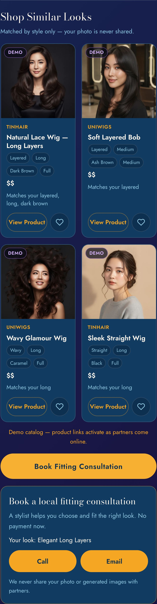

# SP-9 — Wig Catalog / Partner Commerce MVP (Demo)

- **Date:** 2026-06-14 · **Scope:** provider-agnostic **demo** catalog + "Shop Similar Looks" / "Book Fitting Consultation" after AI Wig Match. **No API, no payment, no checkout, no inventory, no real partner links, no partner contact yet.** Frontend-only (no backend change). · **Version:** `?v=20260614k`.
- **Status:** Implemented + verified (live Playwright incl. a privacy leak-scan; 48 unit tests; dry-run PASS; adversarial review **Approve**). Awaiting deploy approval.

## Architecture (provider-agnostic, config-driven)
Two pure config structures in `style-studio-public.js` — adding a partner or product = editing config, no partner-specific code paths:
```js
WIG_PARTNERS = { tinhair:{name,status}, lordhair:{...}, uniwigs:{...} }   // status: demo|affiliate_ready|active
WIG_CATALOG  = [ { id, provider, productName, category, styleType, colorFamily,
                   length, density, audience, priceRange, imageUrl, productUrl, partnerStatus } , … ]
```
The post-Wig-Match flow: `renderWigResult` → `buildWigCommerce(best)` → `matchCatalog(best)` (ranks the catalog) → demo product cards + a fitting-consultation CTA. **`buildWigCommerce` is appended after the wig result and never touches generation.**

## Data model — catalog card fields
`provider · productName · category` (wig / topper / hair_system) `· styleType · colorFamily · length · density · audience · priceRange · imageUrl · productUrl` (placeholder `#`) `· partnerStatus` (demo → affiliate_ready → active) — plus a **dynamic `matchReason`** computed from the attributes that overlap the AI look.

## Privacy design (the core guarantee)
- **Matching uses ONLY non-private text attributes.** `deriveWigAttrs(best)` reads `best.title` + `best.whyItFitsFace` (text) + `state.audience` (man/woman). It **never** reads `selfieDataUrl` or `previewDataUrl`. Matched on: style type, length, color family, density, audience.
- **No image or customer identity is ever sent off-device.** Product images are our own local `/assets/style-studio/…` art (clearly demo). Consultation = `tel:`/`mailto:` to Du Lịch Cali with only the **style title text** in the subject — no image.
- **`productUrl` is a placeholder `#`** for every demo item; `onViewProduct` only navigates externally when `partnerStatus==='active'` (dead path today), so nothing reaches a partner yet.
- **Tracking is local + analytics-safe** (`trackCommerce` → `localStorage`, capped 100, + `console.log`): records `product_view` / `consultation_click` / `save_product` with `{event, productId, provider, status, ts}` — never images, never identity, never an external request.
- **Verified live:** a Playwright leak-scan injected a selfie + generated image carrying secret markers, rendered the Shop section, and confirmed **zero** `data:image`/selfie/generated markers in any Shop href, attribute, or image, and that all product images resolve to local `/assets/`.

## Demo catalog (8 items across the 3 partners)
TINHAIR — Natural Lace Wig (Long Layers, dark brown, full) · Everyday Crown Topper · Sleek Straight Wig. Lordhair — Men's Hair System (Full) · Crown Volume System. UniWigs — Wavy Glamour Wig (caramel) · Soft Layered Bob (ash brown) · Natural Density Topper. Spread across wig / topper / hair_system, men/women, varied length/color/density. **Matching is audience-aware** — a man's wig result leads with Lordhair hair systems; a woman's "long layered" result leads with TINHAIR/UniWigs wigs (both verified live).

## UI (after AI Wig Match)
"**Shop Similar Looks**" + "*Matched by style only — your photo is never shared.*" → up to 4 demo cards (image, **Demo** badge, provider, product name, attribute chips, price range, "Matches your …" reason, **View Product** + **Save**). Below: "**Book Fitting Consultation**" → an inline "Book a local fitting consultation" block (Call / Email to Du Lịch Cali, "No payment now", "We never share your photo or generated images with partners"). View Product on a demo item shows "Demo catalog — product links activate as partners come online." All strings vi/en/es.

## Screenshot


## Tests
- **Live Playwright (iPhone 13):** Shop section appears after a wig result; 4 demo cards; provider/name/chips/price/match-reason/View/Save/Demo-badge present; Book Fitting Consultation reveals the consult block with `tel:+14089163439` + `mailto:` (text-only subject); **privacy leak-scan = 0 leaks**, product images local-only; audience-aware matching (man → Lordhair). Clean run (valid images): **0 console errors**.
- `node --check` clean · `node tests/unit/style-studio.test.js` → 48 passed (regression) · `scripts/ai/full_system_dry_run.sh` → `FINAL: PASS` · adversarial review → **Approve** (privacy PASS; `functions/index.js` untouched).

## PASS criteria
| Requirement | Result |
|---|---|
| Wig Match still generates normally | ✅ additive; generation/result rendering untouched |
| Shop Similar Looks appears after Wig Match | ✅ |
| Demo products shown | ✅ 4 matched demo cards |
| No customer image/data shared externally | ✅ text-only matching, local tracking, no external send |
| No checkout/payment added | ✅ demo only; consult = contact, no payment |
| Architecture can later support real TINHAIR/Lordhair/UniWigs links | ✅ config-driven; `productUrl` + `partnerStatus:'active'` path ready |

## Limitations
- Catalog is a hand-curated **demo**; product images are our own placeholder art (not real partner SKUs).
- `matchReason`/ranking is a lightweight attribute overlap, not a recommender.
- SP-9 logic has live (Playwright) verification but no dedicated offline unit tests yet — a good follow-up (assert `onViewProduct` never navigates for demo; `deriveWigAttrs` ignores image fields; `trackCommerce` payload has no image keys).
- Saved products + commerce events are on-device (localStorage), per privacy-first.

## Future partner onboarding plan
1. **Validate interest** with the demo (the local `product_view` / `save_product` / `consultation_click` signals) before contacting partners.
2. **Per partner:** confirm an affiliate/referral program → set real `productUrl`s + flip `partnerStatus` `demo → affiliate_ready → active` in `WIG_CATALOG` (active enables the existing `onViewProduct` external-open path with `rel=noopener` + UTM attribution). No code change beyond config.
3. **Real catalog feed (optional later):** replace the static `WIG_CATALOG` with a server-fetched, cached feed — still attribute-matched, still no image sent to partners.
4. **Consultation lead capture (optional later):** persist a wig-consult lead (text only) to a new Firestore collection + rules, reusing the existing booking/admin patterns.

**PASS / BLOCKED:** provider-agnostic + privacy-safe (no image/identity leaves the device) + demo products shown after Wig Match + no checkout/payment + generation unaffected + ready to flip to real partner links via config → **PASS pending production deploy + your on-device confirmation.**
