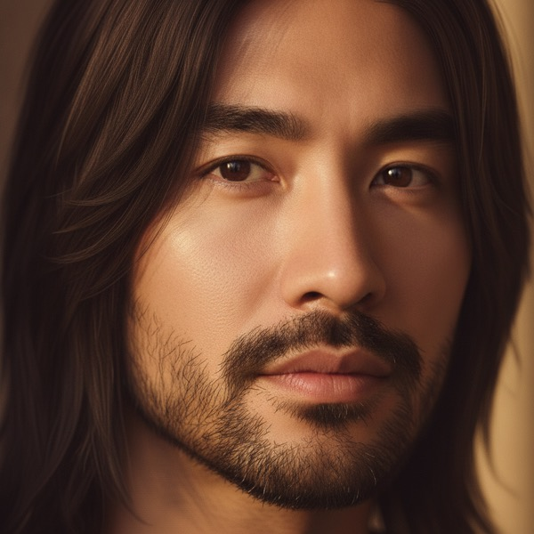
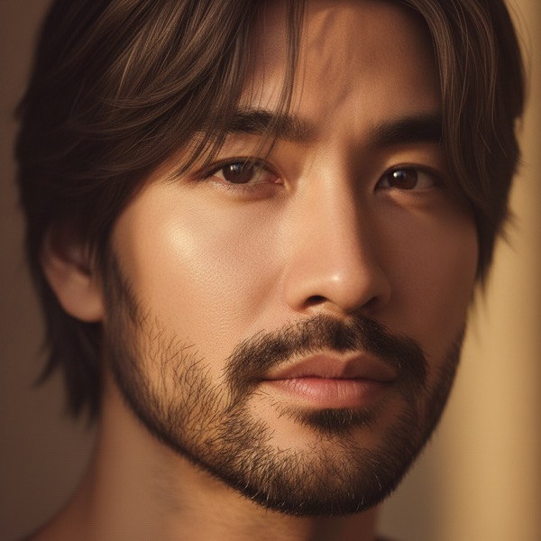
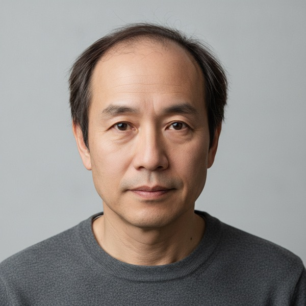
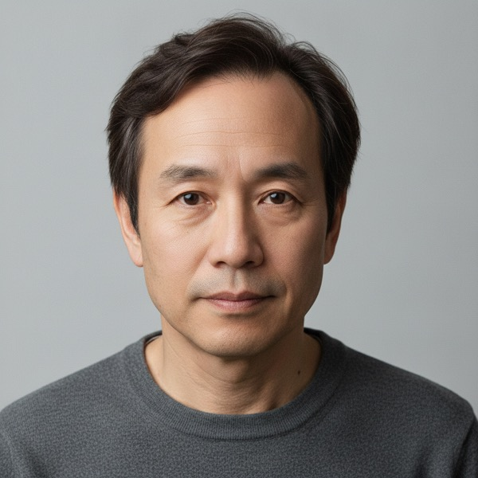

# AI Style Studio — Wig Intelligence + Realism Fix

- **Date:** 2026-06-14 · **Scope:** AI prompting + decision logic + a realism quality gate (no redesign). · **Frontend:** `style-studio-public.js`/`style-studio.css` `?v=20260614e`. · **Backend:** `functions/index.js` + `functions/style-studio-lib.js` (needs `firebase deploy --only functions`).
- **Status:** Implemented + verified (live Gemini A/B + decision tests + visual before/after; 48 unit tests; dry-run PASS). Awaiting deploy approval.

## Root cause
1. **Costume-noun bias.** The image path repeatedly used the noun "wig" (mode guidance, the model-generated `imageEditPrompt`, and even the negated *"NOT a wig, NOT a hairpiece, NOT a costume"* inside `REPLACE_HAIR_CLAUSE`). Image models key on positive nouns **even when negated**, so "wig" → costume output (cap line, helmet, plastic shine, pasted edge). A live A/B confirmed it: the same face with a "wig" prompt rendered a flat, curtain-like wig; with natural-hair framing it rendered believable hair.
2. **Over-recommending wigs.** Master Stylist could "add a natural wig or hair system" with no honest volume analysis first, so it leaned toward added hair even for people with adequate hair.
3. **No environment lock.** Clauses locked identity but not head angle / lighting / shadows / background / neck, so results drifted.
4. **No realism gate.** A fake-looking result was shown as success.

## Prompt changes (image-generation prompts)
- **Removed/neutralized** the trigger words from everything sent to the image model: `wig`, `hairpiece`, `costume`, `lace front`, `synthetic`, `hair replacement` — including a defensive sanitizer in `normalizeHaircutStyle` that rewrites any such noun the vision model emits into natural-hair language (the customer-facing **title/description keep their wording**).
- **Reframed** `REPLACE_HAIR_CLAUSE`, `WIG_REFINE_CLAUSE`, `MASTER_STYLIST_CLAUSE` to describe the **result as the person's own fuller, salon-quality, natural growing hair**, and to preserve identity **+ head angle + lighting + shadows + background + neck**. Positives ("naturally blended hairline", "subtle youthful volume", "believable everyday look", "natural density/growth pattern") replace costume nouns; negatives are stated as **artifacts** ("no hard edge / cap line / helmet / plastic / pasted-on").
- **Subtle-improvement** emphasis added (subtle fuller crown, cleaner shape, better layering, age-appropriate) — explicitly NOT giant volume / dramatic transformation.
- Studio `wig` + `hairsystem` **mode guidance** now instructs the vision model to write `imageEditPrompt`s in natural-hair language (never the word "wig").

## Wig decision logic (Master "Find My Best Look")
The analysis now returns, before choosing a look:
- `hairVolumeAssessment`: `adequate | mild_thinning | moderate_thinning | advanced_thinning`
- `wigDecision`: `{ needed: none|optional|recommended|strong_recommend, reason, naturalAlternative, selectedApproach }`
  where `selectedApproach ∈ haircut|color|texture|eyebrow_beard|subtle_volume|topper|hair_system|wig`.

**Rules enforced in the prompt:** adequate→`none` (haircut/color/texture); mild→`optional` (subtle fuller style); moderate→`recommended` (natural fuller style or topper/hair-system); advanced→`strong_recommend` (natural hair-system). `wig` is never the approach for "Find My Best Look" unless advanced. **Priority order:** haircut → shape/texture → colour/highlight → eyebrow/beard → subtle volume → topper/hair-system **only if truly beneficial**. `bestLook.wigOrSystem` stays empty unless `needed` is recommended/strong.

These fields are coerced to known enums in `normalizeStudioAnalysis` and carried to the client on `masterpiece.wigDecision` so the UI can explain the decision.

## Realism quality gate
After the featured image is generated (Master masterpiece, and the Wig/Hair-System best-match), `realismGate` runs a fast vision check (`assessHairRealism`) that compares the **original selfie vs the result** and flags: fake/costume hair, cap line/helmet/pasted edge/plastic shine, unnatural volume, lighting mismatch, **or identity drift**. If flagged → **retry once** with a max-realism clause → re-check. If it still fails → return `ok:false` `REALISM_FAILED` and the client shows *"We couldn't create a natural-looking result… try a clearer selfie with good lighting."* A checker hiccup never blocks a genuine result (fails open).

## UI text
- Master result shows a transparent note from `wigDecision.needed`: none → "Your current hair volume looks workable — … natural haircut/style improvement instead of added hair."; optional → "A fuller look may help, but a subtle natural hairstyle may be enough."; recommended/strong → "A natural fuller-hair option may create a more balanced, youthful look." (vi/en/es).
- **Pre-upload photo guidance** under the selfie button: "For best results: face the camera, good lighting, hair & hairline visible, no hat or sunglasses, simple background." (vi/en/es).

## Before / after (live Gemini, real prompt clauses)
| | A | B |
|---|---|---|
| **Framing A/B (same face)** | "wig" prompt → costume/curtain  | natural-hair framing → believable  |
| **Thinning → natural fuller** | before (thinning)  | after (subtle natural topper, same person)  |

## Tests run
- **Decision intelligence (real `buildMasterStylistPrompt` via Gemini):** normal-hair man → `hairVolumeAssessment: adequate`, `wigDecision.needed: none`, approach `haircut`, `wigOrSystem: ""`, no "wig" in prompt. Thinning man → `moderate_thinning`, `needed: recommended`, approach `topper`, subtle natural system, no "wig" in prompt. ✓ (does not over-recommend)
- **Realism (A/B):** "wig" framing = costume; natural framing = believable hair. ✓
- **Thinning → result:** same person, natural age-appropriate fuller hairline, no costume look. ✓
- `node --check` (functions + lib + frontend) clean · `node tests/unit/style-studio.test.js` → 48 passed · `scripts/ai/full_system_dry_run.sh` → `FINAL: PASS`.

## DO NOT BREAK — preserved
Create My Look, Hair Style/Color modes, Wig Match page, Vendor Style Studio (shares `runStudioGeneration` + benefits from the same fixes; `ok:false` handled by its UI), login persistence, save/share/download, iPhone upload (incl. the prior tap-reliability fix). The `EDIT_ALL_FAILED` never-text-only contract and member-aware gate from SP-5 are intact.

## Limitations
- Realism/decision quality is model-dependent; the gate is a safety net, not a guarantee — it fails open on checker errors (won't block a good image) and only hard-fails on a confident negative after a retry.
- The wig decision is the model's judgment from a single selfie; poor lighting/angle reduces accuracy (hence the photo guidance).
- The vision gate adds one fast text-model call (+ at most one retry edit) on the featured image only — bounded latency; not run on every wig thumbnail.

**PASS / BLOCKED:** AI no longer over-recommends wigs (normal hair → none; thinning → subtle topper), Master uses wig only when appropriate, Wig Match produces subtle natural fuller hair (not costume), and fake/identity-drifted results are retried or clearly failed → **PASS pending `firebase deploy --only functions` + `--only hosting` and your on-device confirmation.**
